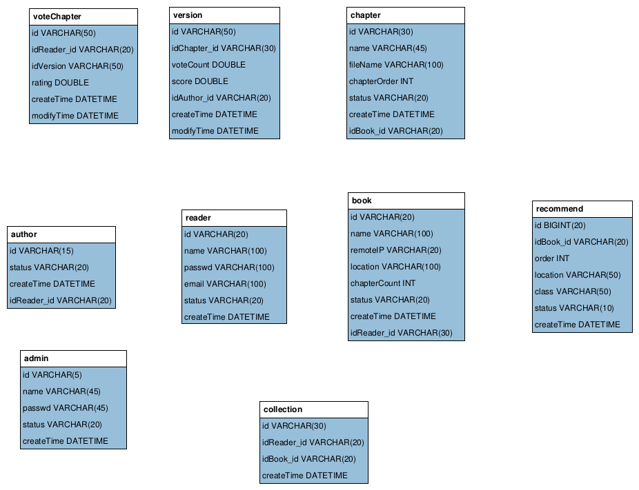

# WeArt
This is the independent Study of NTUST. Our group have two members, Da-Xiang Li and Tian-You Zhang.

This project is a website using git and Python. We want to help people that have ideas but not has so much time to complete their arts like novel.Everyone interesed on your art can apply to write new version content or next chapter, according to your novel outline.

# Documents Introduction
The doc folder has Database Design(ER Model), function list, progress(include gantt chart), Architecture Design and other documents. ER model uses the **MySQL Workbench 6.3**(community version) software. Architecture Design uses **StartUML 2.8.0** software. Use Apache HTTP server benchmarking tool (**ab tool**) for Performance Tests.

### [Gantt Chart](http://htmlpreview.github.io/?https://github.com/0lidaxiang/WeArt/blob/master/doc/ganttChart.html)
### [Progress](./doc/progress.md)  
### [Main Function List](./doc/main-function-list.md)  
### [Ideas](./doc/ideas-and-design.md)  
### [Pictures Designed for Front-End](./doc/front_end_design)  

### Architecture Model

### Use Case Diagram(From function view)

### Class Diagram(From behavior view)

### ER Model Design

