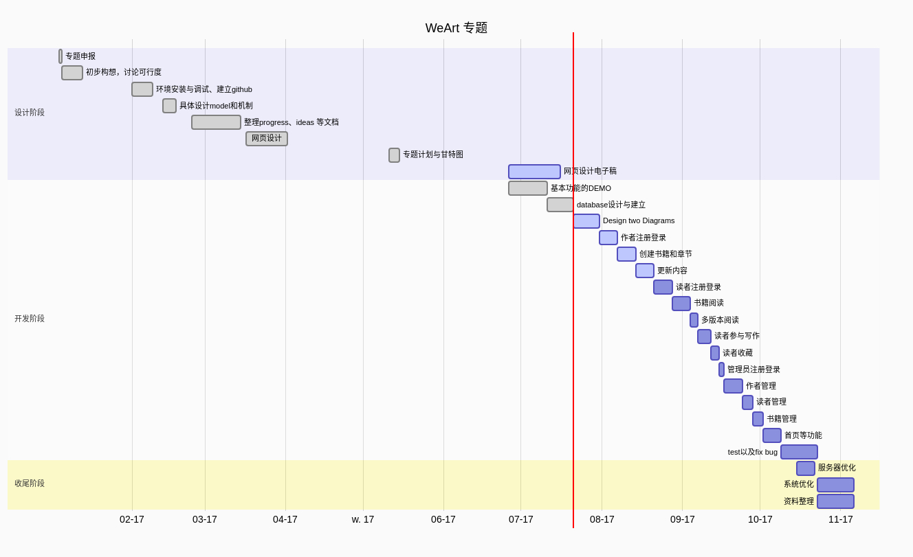

# Plan and Process
> Author: 李大祥
StartTime : 2017-02-25
ModifyTime :  2017-06-30

> gantt chart的源代码在 WeArt.gantt 里面，把gantt chart 源代码粘贴到 [在线编辑器](http://knsv.github.io/mermaid/live_editor/) 上，即可获得上面的甘特图，之后就可以截图或也可以下载 SVG 格式或者选择 VIEW 模式。另外一种办法是自己安装 mermaid 库进行编译这些代码。

## 1. Preparation Phrase Plan
+ [x] ~~1. Test how to use git server software.~~
+ [x] ~~2. Make sure that whether it can to use python to control linux commands.~~
+ [x] ~~3. Search for maximum user number by logging via SSH.~~
+ [x] ~~4. Learn python and django framework.~~
+ [x] ~~5. Design the system.~~
+ [x] ~~6. Write the ideas and design textbook, named 'ideas-and-design.md'.~~
+ [x] ~~7. Create a github repository.(It is named 'WeArt.md' meaning that our arts and we create arts together.)~~
+ [x] ~~8. Write the plan and process textbook.~~
+ [x] ~~9. Organize the all commands and test excuted by python.(2017-0701)~~
+ [x] ~~10. Write a demo that it can show control novel's version.(2017-0706)~~
+ [x] ~~11. Build the Server using two computer in teacher's lab.(2017-0714)~~

## 2. Development Phrase Plan
+ [x] 1. ~~Design and Build Database.(2017-07-20)~~
+ [ ] 2. Design Use case diagram and Class diagram.(2017-07-22)
+ [ ] 3. Author can login and register.(2017-07-26)
+ [ ] 4. Author can create a novel and chapters.(2017-07-26)
+ [ ] 5. Author can update the novel content.(2017-08-02)
+ [ ] 6. Reader can login and register.(2017-08-09)
+ [ ] 7. Reader can read books and chapters.(2017-08-09)
+ [ ] 8. Reader can read different version content.(2017-08-09)
+ [ ] 9. Differnt Readers can write one chapter and send different version for the same story.(2017-08-09)
+ [ ] 10. Reader can collect their favorite books.
+ [ ] 11. Administrator registers and logins.
+ [ ] 12. Administrator manages authors(register, login, refuse, lock account,delete account).
+ [ ] 13. Administrator manages readers(register, login, refuse, lock account,delete account).
+ [ ] 14. Administrator manages books.
+ [ ] 15. The home pages and other functions.

## 3. Test Phrase Plan
+ [ ] 1. Function Test & Unit Test
+ [ ] 2. Pressure Test
+ [ ] 3. Load Test
+ [ ] 4. All Test results books.

## 4. Others
+ [ ] 1. Write the Readme file in github and other files.
+ [ ] 2. Modify all texts about this project.ex: sql files, process file, server enviroment building shell...
